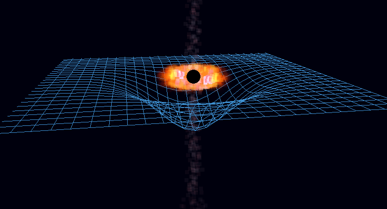
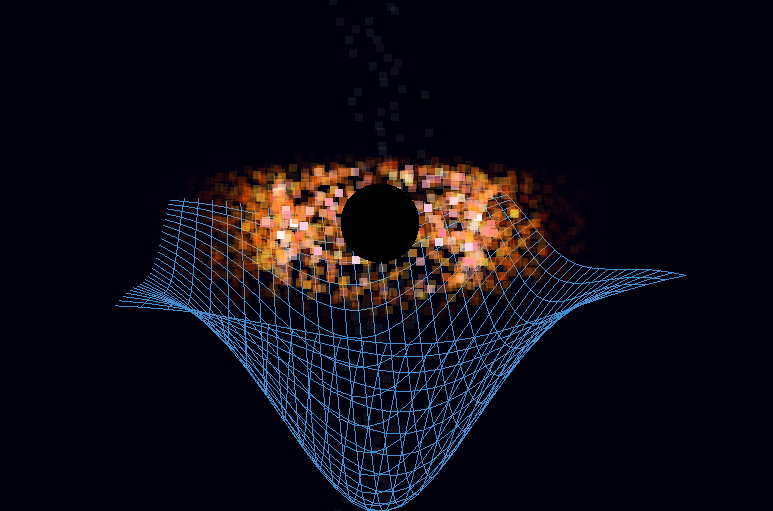

# Black Hole Simulator

[](LICENSE)

A C++ and OpenGL-based black hole visualisation and accretion disk simulation featuring realistic gravitational effects, spacetime curvature, and particle dynamics. Made by Krystian Filipek for the Camhack Hackathon.

<div align="center">




</div>

## Features

### Visualisation Components
- **Black Hole Event Horizon** - Dynamically scaled sphere representation
- **Accretion Disk** - Realistic particle-based disk with temperature and density
- **Spacetime Grid** - Visual representation of gravitational curvature
- **Relativistic Jets** - High-velocity material ejection simulation

### Physics Models
| Component | Description |
|-----------|-------------|
| Spacetime Curvature | Mass-dependent grid deformation |
| Keplerian Orbits | Realistic orbital mechanics |
| Temperature Distribution | Blackbody radiation color mapping |
| Density Gradients | Particle distribution modeling |
| Doppler Effects | Velocity-based color shifting |
| Gravitational Redshift | Near-horizon frequency effects |

### Interactive Controls
```
Mouse Controls:
- Left Click + Drag: Rotate camera
- Scroll Wheel: Zoom in/out

Keyboard Controls:
- Up Arrow / +: Increase black hole mass
- Down Arrow / -: Decrease black hole mass  
- R: Reset mass to default
```

</div>

## Getting Started

### Prerequisites
- **MSVC Compiler** Visual Studio 2022 used
- **OpenGL 3.3+** compatible graphics card
- **Windows 10/11** (current build targets Windows, might add linux?)

### Building the Project
1. Clone the repository:
   ```bash
   git clone https://github.com/kfilipekk/Black-Hole-Visualisation.git
   cd Black-Hole-Visualisation
   ```

2. Build using the provided task:
   ```bash
   # Using VS Code
   Ctrl+Shift+P > "Tasks: Run Task" > "Build Black Hole Simulation"
   
   # Or manually with MSVC
   cl.exe /EHsc /DGLEW_STATIC src/main.cpp src/AccretionDisk.cpp -I"vendor/glfw-3.4.bin.WIN64/include" -I"vendor/glew-2.1.0/include" -I"vendor" /link /LIBPATH:"vendor/glfw-3.4.bin.WIN64/lib-vc2022" /LIBPATH:"vendor/glew-2.1.0/lib/Release/x64" glfw3dll.lib glew32s.lib opengl32.lib user32.lib gdi32.lib shell32.lib
   ```

3. Run the simulation:
   ```bash
   main.exe
   ```

## Dependencies

The project includes all necessary libraries:
- **GLFW 3.4** - Window management and input handling
- **GLEW 2.1.0** - OpenGL extension loading
- **GLM** - Mathematics library for graphics
- **OpenGL** - Graphics rendering API

## Physics Accuracy

The simulation incorporates:
- **Keplerian orbital mechanics** for particle motion
- **Schwarzschild metric** approximations for spacetime curvature
- **Blackbody radiation** temperature-to-color mapping
- **Logarithmic spiral arms** for realistic disk structure
- **Relativistic effects** including Doppler shifting and redshift

## Applications

I created this project to explore:
- Real-time graphics programming with OpenGL
- Advanced particle system design
- Astrophysical simulation techniques
- Shader programming for visual effects

## Future Plans

- Light accretion from solar bodies
- Smoother accretion disk

<div align="center">

Developed by [kfilipekk](https://github.com/kfilipekk)

</div>
